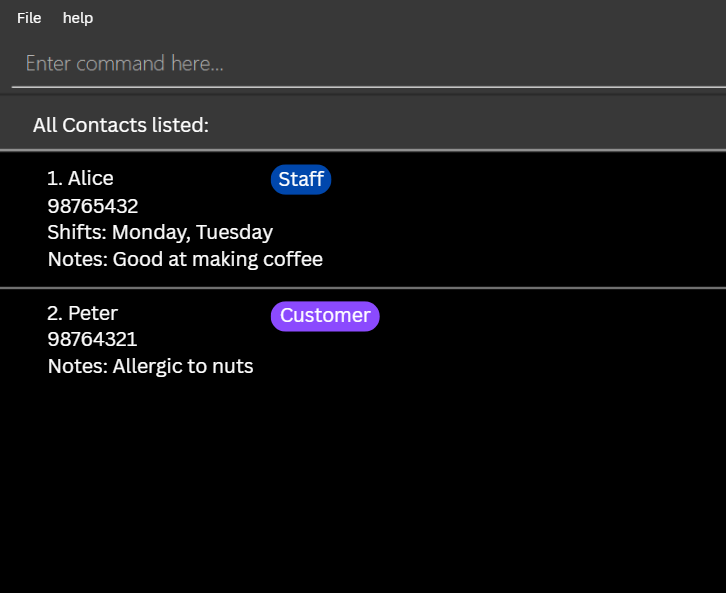

- This is **BrewBook**, a team project for Software Engineering (SE) students taking CS2103T. 
- BrewBook helps you to manage the information of different stakeholders (e.g. suppliers) in your cafe to enhance organisation and coordination of human resources.
- For the detailed documentation of this project, see the **[BrewBook Product Website](https://ay2526s1-cs2103t-t09-4.github.io/tp/)**.
- This project is based on the AddressBook-Level3 project created by the [SE-EDU initiative](https://se-education.org).
