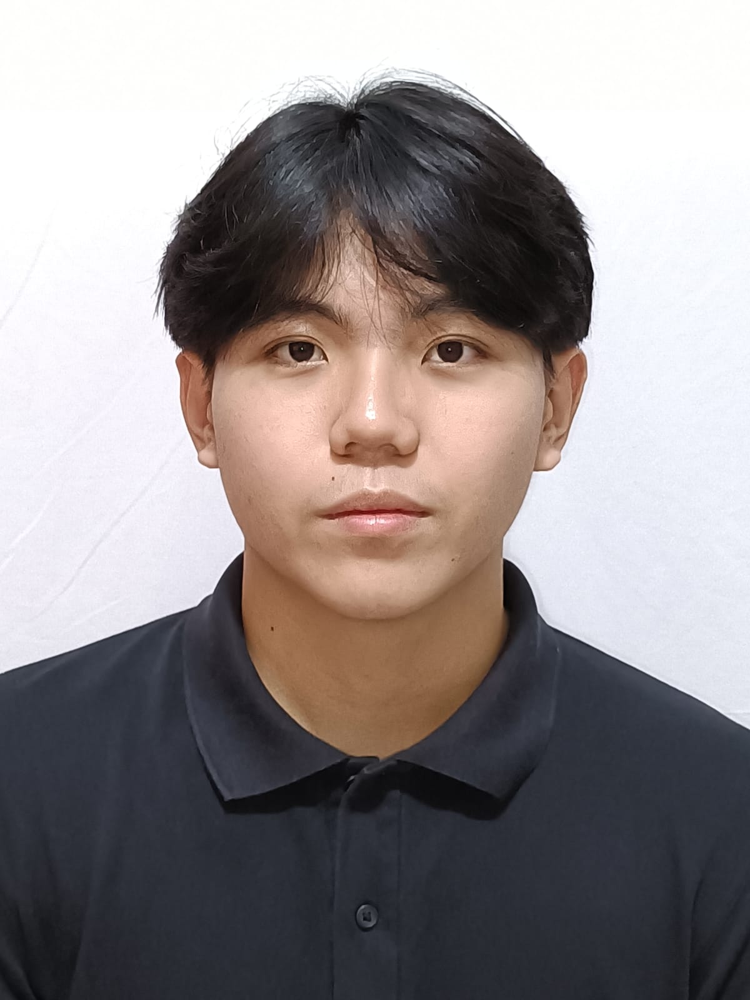

We are a team based in the [School of Computing, National University of Singapore](https://www.comp.nus.edu.sg).

You can reach us at the email `seer[at]comp.nus.edu.sg`

## Project team

### John Doe

[[homepage](http://www.comp.nus.edu.sg/~damithch)]
[[github](https://github.com/johndoe)]
[[portfolio](team/johndoe.md)]

* Role: Project Advisor

### Don Koo

[[github](http://github.com/donkoo24)]
[[portfolio](team/johndoe.md)]

* Role: Team Lead
* Responsibilities: UI

### Gabriel Yap

[[github](http://github.com/yapitsgabriel)] [[portfolio](team/johndoe.md)]

* Role: Developer
* Responsibilities: Data

### Leonard

[[github](http://github.com/biscake)]
[[portfolio](team/johndoe.md)]

* Role: Developer
* Responsibilities: Dev Ops + Threading

### Dylan Tang

[[github](http://github.com/bluemayo)]
[[portfolio](team/johndoe.md)]

* Role: Developer
* Responsibilities: UI

### Jonathan Graziano Yang

[[github](http://github.com/jongrazi)]
[[portfolio](team/jongrazi.md)]

* Role: Developer
* Responsibilities: UI
