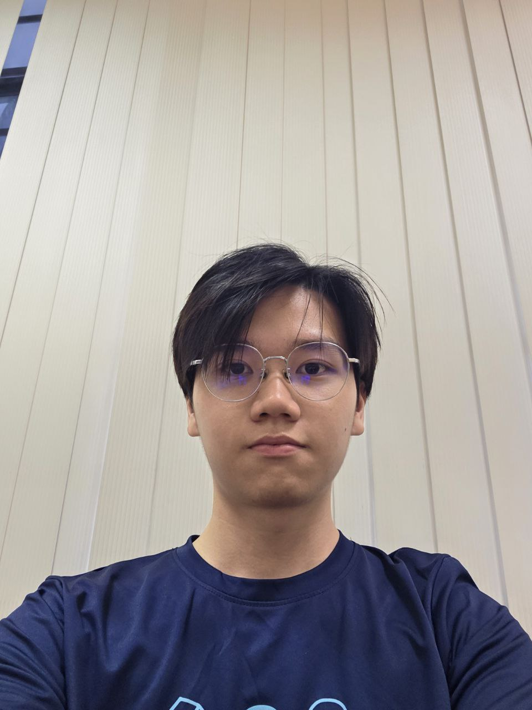
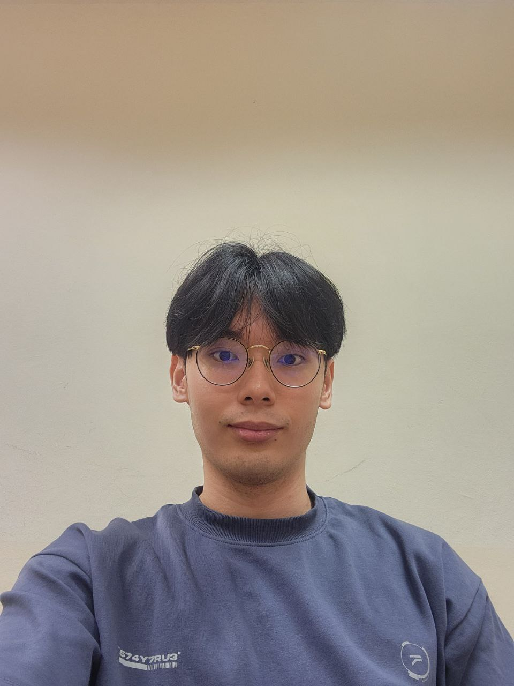
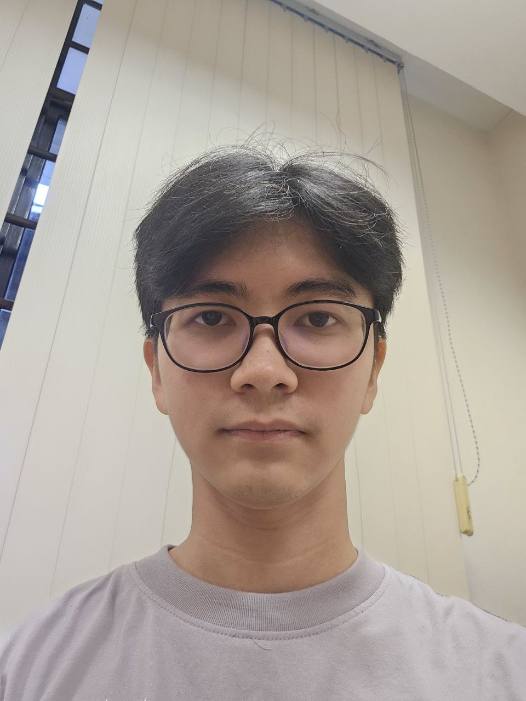
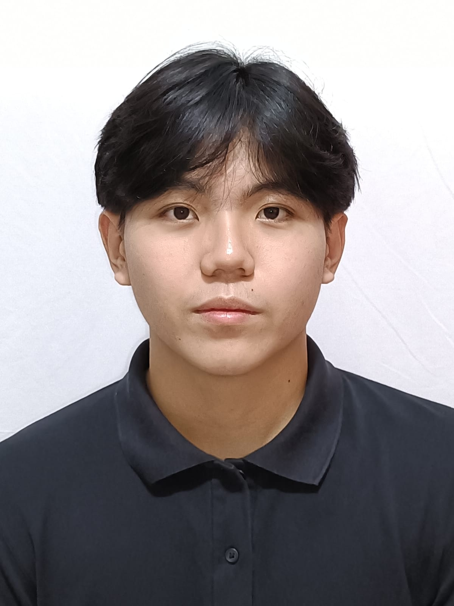

We are a team based in the [School of Computing, National University of Singapore](https://www.comp.nus.edu.sg).

## Project team

### Don Koo

[[github](http://github.com/donkoo24)]
[[portfolio](team/don.md)]

* Role: Team Lead
* Responsibilities: UI

### Gabriel Yap

[[github](http://github.com/yapitsgabriel)] [[portfolio](team/gabriel.md)]

* Role: Developer
* Responsibilities: Data

### Leonard

[[github](http://github.com/biscake)]
[[portfolio](team/leonard.md)]

* Role: Developer
* Responsibilities: Dev Ops + Threading

### Dylan Tang

[[github](http://github.com/bluemayo)]
[[portfolio](team/dylan.md)]

* Role: Developer
* Responsibilities: UI

### Jonathan Graziano Yang

[[github](http://github.com/jongrazi)]
[[portfolio](team/jongrazi.md)]

* Role: Developer
* Responsibilities: UI
